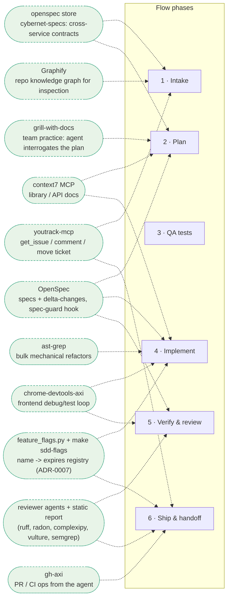

# Team workflow: from signal to merged PR

End-to-end flow (feature or bug) with every tool's plug-in point.
The first diagram is the flow itself; the second maps tools to phases.
Cross-cutting tools (active in every phase) are listed after the diagrams.

This document describes the TARGET process. What is already running vs
still planned is tracked in the **Status** section at the end; planned
pieces are marked *(planned)* in the text.

Grounding: RAISE intake = ADR-0009; task tiers & models = ADR-0010;
epic/flags/handoff seam = ADR-0011; grill/QA/epic clarifications =
ADR-0012; branch & PR gates = ADR-0006; enforcement = ADR-0003, deliberately
advisory today = ADR-0015; testing = `QA-SDD-PROCESS.md` + ADR-0016 (tests are
written from the spec delta BEFORE implementation, and never by whoever writes
the implementation: today the `test-author` agent writes them and a human QA
validates; human QA owning the step is the target).
The per-task orchestration lives in the `feature-flow`
skill (features) and `incident-flow` skill (bugs/incidents) - this diagram
is those skills drawn as one picture.

```mermaid
flowchart TD
    %% ============ RAISE INTAKE (above the dev process, ADR-0009) ============
    subgraph RAISE["0 · RAISE intake (company process)"]
        FEAT["Feature request<br/>(business / Rashid)"]
        FORM["Request form + RICE score<br/>(requester, validated by process owner)"]
        BOARD["Voicebot + LLM board:<br/>monthly review / urgent ad-hoc path"]
        BUG["Bug signal<br/>(Telegram: 'something broke')"]
        BUGREP["Bug report ticket (immediately,<br/>no RICE): env, Dialogue ID, steps,<br/>actual/expected, priority"]
        YT["YouTrack ticket WEB-XXXX<br/>accepted into a sprint"]
        FEAT --> FORM --> BOARD --> YT
        BUG --> BUGREP --> YT
    end

    %% ============ INTAKE + TIER ============
    subgraph INTAKE["1 · Check / inspect + tier (feature-flow 1, 1b · incident-flow 1, 2)"]
        READ["Interrogate the ticket:<br/>cross-check claims against code & specs;<br/>missing RICE form = warn, not block"]
        INC["Bug only: collect evidence<br/>(CybernetKZ/incident_collect,<br/>needs its .env configured) -> root-cause doc"]
        CLASS{"Root cause?"}
        STOPDOC(["Client misuse / infra: the root-cause<br/>doc IS the deliverable. Ticket comment +<br/>status via youtrack-mcp; the ticket author /<br/>process owner closes it, not the dev<br/>(interim decision, ADR-0012)"])
        Q{"Serious business fork?"}
        ASK["Ask author (ticket comment);<br/>meanwhile build a PROTOTYPE on the<br/>recommended answer - marked as such,<br/>with a request to verify it"]
        NOTE["Non-blocking gaps: note assumptions,<br/>ask + proceed on recommended answers"]
        TIER["Pick tier: light / standard / deep<br/>(heuristic table below; dev may override;<br/>tier + why -> into the change)"]
        READ --> Q
        Q -- "yes" --> ASK --> READ
        Q -- "no" --> NOTE --> TIER
    end
    YT --> READ
    BUGREP -.-> INC --> CLASS
    CLASS -- "misuse / infra" --> STOPDOC
    CLASS -- "code bug" --> READ

    %% ============ PLAN ============
    subgraph PLANNING["2 · Plan (OpenSpec change) (feature-flow 2 · incident-flow 3)"]
        RESEARCH["deep tier only: research architecture<br/>options, compare, write ADR"]
        PLAN["planner agent (opus): /opsx:propose -<br/>proposal + spec deltas + tasks<br/>(ticket id, tier + why inside)"]
        GRILL["standard/deep: plan-griller agent (opus)<br/>grills the plan, the dev answers (ADR-0012) -<br/>edge cases, rollback, migrations, cross-service;<br/>unanswered -> question to the ticket author.<br/>Q&A recorded as '## Grill' section in proposal.md"]
        POK{"Plan holds?"}
        RESEARCH --> PLAN
        PLAN -- "standard/deep" --> GRILL --> POK
        POK -- "no: fix plan, not code later" --> PLAN
    end
    TIER -- "deep" --> RESEARCH
    TIER -- "standard" --> PLAN
    TIER -- "light: minimal change<br/>(why + what + regression test)" --> PLAN

    %% ============ QA: TESTS BEFORE CODE ============
    subgraph QAF["3 · Tests from the spec delta, BEFORE code (QA-SDD-PROCESS.md, ADR-0016)"]
        QAVAL["Validate the spec delta:<br/>every Requirement has a measurable<br/>Scenario (WHEN/THEN), edge cases covered,<br/>no conflict with existing contracts"]
        QOK{"Spec delta<br/>testable?"}
        QATESTS["test-author agent writes tests from<br/>Scenarios - one test (or explicit skip)<br/>per Scenario, tracer '# spec: requirement /<br/>scenario'. The implementer never writes them;<br/>human QA ownership = target (ADR-0016)"]
        ADV["Adversarial check: independent agent<br/>tries to refute each test<br/>(green-stub detection)"]
        RED["Tests RED before implementation"]
        QAVAL --> QOK
        QOK -- "yes" --> QATESTS --> ADV --> RED
    end
    POK -- "yes" --> QAVAL
    QOK -- "no: spec delta back<br/>to its author" --> PLAN
    PLAN -- "light: minimal spec delta,<br/>same QA validation" --> QAVAL

    %% ============ IMPLEMENT ============
    subgraph IMPL["4 · Implement (feature-flow 4, 4b · incident-flow 4)"]
        CODE["Branch feature/WEB-XXXX off dev.<br/>Code + spec deltas move together.<br/>QA tests already exist - dev runs them<br/>locally while implementing.<br/>Epic: several small PRs behind a feature flag<br/>(OFF everywhere until FLAG_NAME=1)"]
        RUN1["Run QA tests"]
        T1{"Green?"}
        FIX["Fix implementation<br/>(never the tests - they are QA's)"]
        CODE --> RUN1 --> T1
        T1 -- "no: code wrong" --> FIX --> RUN1
        T1 -- "no: test contradicts its Scenario -<br/>dispute it: back to QA with the argument,<br/>dev never edits the test (ADR-0012)" --> QATESTS
    end
    RED --> CODE

    %% ============ VERIFY ============
    subgraph VERIFY["5 · Verify & review (feature-flow 5, 6 · incident-flow 5)"]
        MANUAL["Manual testing: walk the QA Scenarios<br/>on local/stage; incident: re-run the<br/>incident scenario, record before/after"]
        SDDCHECK["make sdd-check green<br/>(AGENTS.md + openspec validate + spec-lint)"]
        REVIEW["Review: reviewer agents on the diff<br/>(backend-reviewer + database-reviewer,<br/>ECC-derived, ours now)"]
        SCOPE{"Findings in scope<br/>of the ticket?"}
        APPLY["Implement suggestions"]
        TODO["Add TODO/NOTE with ticket id<br/>(no silent scope creep)"]
        RUN2["Run tests"]
        T2{"Green?"}
        MANUAL --> SDDCHECK --> REVIEW --> SCOPE
        SCOPE -- "yes" --> APPLY --> RUN2 --> T2
        SCOPE -- "no" --> TODO --> PR
        T2 -- "no" --> APPLY
    end
    T1 -- "yes" --> MANUAL

    %% ============ SHIP ============
    subgraph SHIP["6 · Ship & handoff (feature-flow 7, 8 · incident-flow 5, 6)"]
        PR["Open PR to dev<br/>[feature/WEB-XXXX] title, test plan in body.<br/>Gates: branch age (2d warn / 5d fail),<br/>PR size (xl-ok label needs 'Why XL')"]
        CI["Blocking: sdd-gate (-> make test (planned):<br/>linters + validate + pytest + contract tests),<br/>traceability gate (planned): each Scenario ⇄ one test,<br/>QA quality gate (planned, QA-SDD-PROCESS.md).<br/>Advisory: autoreview AI comments"]
        CIOK{"Blocking gates green?"}
        MERGE["Merge to dev"]
        HANDOFF["Ticket -> status: ready_to_test<br/>+ comment for QA ≤ 1 paragraph:<br/>what & how to check, flag name + FLAG_NAME=1 if any"]
        QA["QA verifies on stage (enables the flag<br/>with FLAG_NAME=1 per the handoff comment);<br/>then the flag owner enables it in prod<br/>(same owner deletes it at expires, ADR-0013);<br/>change archived"]
        PR --> CI --> CIOK
        CIOK -- "no" --> APPLY
        CIOK -- "yes" --> MERGE --> HANDOFF --> QA
    end
    T2 -- "yes" --> PR

    classDef terminal fill:#fdf2e0,stroke:#c93
    class STOPDOC terminal
```

## Tool plug-ins (which tool serves which phase)

## Task tiers (ADR-0010)

Tiers scale preparation depth only - **gates never change**: spec always
exists (minimal for light), QA tests before code, sdd-check, review, CI.
No spec-guard bypass on any tier. Tasks genuinely differ: a small clear
edit ships via light right away; a risky or cross-service one earns the
full spec grilling - the tier decides depth, never whether gates apply.

| Tier | Adds / skips |
|---|---|
| light | minimal spec delta (why + what); no plan grill; QA still writes the test - for bugs, the regression test reproducing the incident |
| standard | the full feature-flow above, QA flow per QA-SDD-PROCESS.md |
| deep | + architecture research phase (options compared, ADR written) + mandatory plan grill |

Picking the tier - the default comes from this heuristic (dev may
override; the chosen tier + why goes into the change):

| Task looks like | Default tier |
|---|---|
| typo / config value / isolated bug with no cross-service impact | light |
| a regular feature inside one service | standard |
| cross-service change, data migration, new architecture, unknown territory | deep |

Model binding is pinned in agent frontmatter, not in people's memory:
plan and grill run as the `planner` / `plan-griller` subagents
(`.claude/agents/`, `model: opus` - installed by bootstrap, ADR-0013);
implementation -> session model; reviewer agents -> their `model`
frontmatter; mechanical steps -> haiku.

## Epics (ADR-0011, ADR-0012, ADR-0013)

The unit of work is fixed: **1 YouTrack task = 1 PR**. An epic is split
into YouTrack tasks at intake (declared in the tracker, not invented in
tasks.md) - the epic's breakdown and progress live in YouTrack. One OpenSpec
change spans the whole epic behind one feature flag (ADR-0011); each task's
PR moves its slice of code and runs the QA tests that already exist.
Exception to 1:1: follow-up fix PRs for an already-accepted feature may
ride the original task.

Suspect an undeclared epic whenever the plan predicts crossing the ADR-0006
gates - >1500 changed lines or >2 days of work for a single PR - and
confirm the split with the ticket author before starting.

QA for an epic (ADR-0013): tests are written ONCE for the whole change
(all Scenarios, before the first PR); Scenarios not yet implemented stay
as explicit skips or run behind the OFF flag. Intermediate merges do NOT
ping QA - the single `ready_to_test` handoff happens when the whole change
is done on stage.

## QA availability (ADR-0012)

QA in phase 3 is a role on the critical path. When the QA person is
unavailable, the dev still does not write tests in their own session:
they launch the **independent QA agent** (per QA-SDD-PROCESS.md) in a
separate context. The adversarial check stays mandatory, and the PR
notes that tests were agent-generated without human QA validation -
human QA catches up before the flag is enabled in prod.

For flagless changes (typical light tier) the catch-up point is the
release: **`ready_to_test` holds the release** (ADR-0013) - before
deploying dev to prod, the release checklist verifies in YouTrack that no
shipped ticket is still in `ready_to_test` without a human QA verdict.
This is a process rule (like RAISE), not a CI gate.

## Disputed tests (ADR-0012)

A red test means one of three things, each with its own exit:

1. The implementation is wrong -> fix the implementation (the normal loop).
2. The test contradicts its Scenario -> the dev disputes it: the test goes
   back to QA with the argument "contradicts Scenario X". The arbiter is
   the Scenario text. The dev never edits the test.
3. The Scenario itself is ambiguous -> the spec delta goes back to its
   author (the existing "spec delta back to its author" path).

## Where the named pieces live

| Piece | Place in the flow |
|---|---|
| `feature-flow` skill | IS phases 1-6 for features (its steps 1->8 are marked on the phase titles) - the orchestrator the agent follows |
| `incident-flow` skill | IS phases 1-6 for bugs (steps 1->6 marked on the phase titles); owns the misuse/infra terminal exit; defaults to light tier |
| `QA-SDD-PROCESS.md` | IS phase 3 and the test-related CI gates: QA validates the spec delta and writes tests before implementation; developers do not write tests |
| `AGENTS.md` (+`CLAUDE.md` symlink) | ambient context read by the agent in every phase; existence/size gated by sdd-check |
| `planner` / `plan-griller` agents | phase 2 on opus (`model` frontmatter, ADR-0013): planner writes the change, plan-griller interrogates it |
| `spec-miner` agent | repo onboarding only (seed specs one capability at a time), NOT in the per-task loop; OpenSpec has no built-in equivalent |
| reviewer agents | `backend-reviewer` + `database-reviewer` - ECC-derived (commit ec92b528), consolidated from four agents into two; they replace the old `review-pr.md` prompt, locally (`make sdd-review`) and in CI autoreview |

## No magic: prompts vs hooks (what actually enforces)

"Skills", "rules" and "plugins" are marketing names for prompts - instruction
texts injected into the model's context, on every request or at key points.
The model can ignore them: a prompt is advice, never a guarantee. Hooks
(pre-commit, PreToolUse/PreCompact) are ordinary deterministic code bound to
events - e.g. blocking a code edit that has no active openspec change, or
ruff autofix on staged Python before every commit - and cannot be ignored.

Consequences:

- **Enforcement lives only in deterministic code** (hooks + CI gates).
  Prompt-layer pieces (feature-flow, reviewer agents) are advisory - useful,
  but a standard cannot rest on them.
- **Verifiability is mandatory.** Every skill/tool must have a way to confirm
  it actually ran: a measured artifact, a log line, a gate that fails without
  it. Unverifiable pieces get removed - 95% of ~285 installed skills were
  never used once (`docs/archive/OUR_PATTERNS.md`), and `repo-audit` exists to keep it
  that way.

## Prototype instead of waiting

A serious business fork blocks the decision, not the hands: while the ticket
author answers, build a prototype on the recommended answer - explicitly
marked as a prototype, with a request to verify it. The answer either
confirms the direction or the prototype is cheaply discarded; both beat
idling. This never bypasses gates: the prototype lives behind the same
OpenSpec change, and merging still requires the full flow.

## Cross-cutting tools (active in every phase)

Installed per developer machine by `install.sh --machine-only` (core stack, default-yes):

| Tool | What it does |
|---|---|
| **rtk** | compresses shell output in every Bash call (global hook) |
| **ponytail** | minimal working solutions; less code, fewer tokens (plugin) |
| **ast-grep** | structural codemods for bulk mechanical refactors |
| **spec-guard + pre-commit hooks** | block code edits without an active OpenSpec change (not in conversation_flow - LIVING SPEC exception); ruff, hygiene, `make sdd-check` on commit |

Opt-in (y/N): **gh-axi**, **chrome-devtools-axi**, **serena** (earlier trial
left `.serena/` litter; the sdd-doctor audit section flags it). **caveman** is not installed -
it exists only as a benchmark arm inside the ponytail repo; ponytail covers it.

## Status: what runs today vs what is planned

Last verified: 2026-07-31. Update this table when a planned piece goes live.

| Component | Status |
|---|---|
| bootstrap assets: `make sdd-check`, spec-guard, pre-commit hooks, `sdd-ci.yml` (incl. tbd-gates), autoreview, spec-lint, sdd-doctor (incl. audit section) | shipped by sdd-kit - live in a repo once bootstrapped |
| `feature-flow` / `incident-flow` skills | shipped (`templates/skills/`) |
| `planner` / `plan-griller` agents (model binding for plan/grill) | shipped (`templates/agents/`, ADR-0013) |
| RAISE intake (form, RICE, board) | company process being introduced (ADR-0009) |
| `make test` single CI entry point (ADR-0003) | **planned** - not yet implemented in any repo |
| QA-SDD-PROCESS running in practice (QA writes tests before code) | **planned** - process defined, not yet running in a team repo |
| traceability gate (Scenario ⇄ test) in CI | **planned** - no implementation yet |
| QA quality gate in CI | **planned** |
