# Team workflow: from signal to merged PR

End-to-end flow (feature or bug) with every tool's plug-in point.
Solid arrows = the flow; dotted arrows = a tool plugging into a phase.
Cross-cutting tools (active in every phase) are listed after the diagram.

Grounding: RAISE intake = ADR-0009; task tiers & models = ADR-0010;
epic/flags/handoff seam = ADR-0011; branch & PR gates = ADR-0006;
enforcement = ADR-0003; testing = `QA-SDD-PROCESS.md` (a separate QA
workflow: tests are written BEFORE implementation, and developers do NOT
write tests - QA does, from the manifest). The per-task orchestration lives
in the `feature-flow` skill (features) and `incident-flow` skill
(bugs/incidents) - this diagram is those skills drawn as one picture.

```mermaid
flowchart TD
    %% ============ RAISE INTAKE (above the dev process, ADR-0009) ============
    subgraph RAISE["0 · RAISE intake (company process)"]
        FEAT["Feature request<br/>(business / Rashid)"]
        FORM["Request form + RICE score<br/>(requester, validated by process owner)"]
        BOARD["Voicebot + LLM board:<br/>monthly review / urgent ad-hoc path"]
        BUG["Bug signal<br/>(Telegram: 'something broke')"]
        BUGREP["Bug report ticket (immediately,<br/>no RICE): env, Dialogue ID, steps,<br/>actual/expected, priority"]
        YT["YouTrack ticket WEB-XXXX<br/>accepted into a sprint"]
        FEAT --> FORM --> BOARD --> YT
        BUG --> BUGREP --> YT
    end

    %% ============ INTAKE + TIER ============
    subgraph INTAKE["1 · Check / inspect + tier (feature-flow 1, 1b · incident-flow 1, 2)"]
        READ["Interrogate the ticket:<br/>cross-check claims against code & specs;<br/>missing RICE form = warn, not block"]
        INC["Bug only: collect evidence<br/>(collect_incident.py) -> root-cause doc"]
        CLASS{"Root cause?"}
        STOPDOC(["Client misuse / infra:<br/>the doc IS the deliverable - stop"])
        Q{"Serious business fork?"}
        ASK["Ask author (ticket comment);<br/>meanwhile build a PROTOTYPE on the<br/>recommended answer - marked as such,<br/>with a request to verify it"]
        NOTE["Non-blocking gaps: note assumptions,<br/>ask + proceed on recommended answers"]
        TIER["Pick tier: light / standard / deep<br/>(ticket value -> default; dev may override;<br/>unset -> agent decides; tier + why -> into the change)"]
        READ --> Q
        Q -- "yes" --> ASK --> READ
        Q -- "no" --> NOTE --> TIER
    end
    YT --> READ
    BUGREP -.-> INC --> CLASS
    CLASS -- "misuse / infra" --> STOPDOC
    CLASS -- "code bug" --> READ

    %% ============ PLAN ============
    subgraph PLANNING["2 · Plan (OpenSpec change) (feature-flow 2 · incident-flow 3)"]
        RESEARCH["deep tier only: research architecture<br/>options, compare, write ADR"]
        PLAN["/opsx:propose - proposal + spec deltas +<br/>tasks (ticket id, tier + why inside).<br/>Plan/grill/research run on opus/fable"]
        GRILL["standard/deep: grill the plan -<br/>edge cases, rollback, migrations,<br/>cross-service impact.<br/>Q&A recorded as '## Grill' section in proposal.md"]
        POK{"Plan holds?"}
        RESEARCH --> PLAN
        PLAN -- "standard/deep" --> GRILL --> POK
        POK -- "no: fix plan, not code later" --> PLAN
    end
    TIER -- "deep" --> RESEARCH
    TIER -- "standard" --> PLAN
    TIER -- "light: minimal change<br/>(why + what + regression test)" --> PLAN

    %% ============ QA: TESTS BEFORE CODE ============
    subgraph QAF["3 · QA: tests from the manifest, BEFORE code (QA-SDD-PROCESS.md)"]
        QAVAL["QA validates the manifest:<br/>every Requirement has a measurable<br/>Scenario (WHEN/THEN), edge cases covered,<br/>no conflict with existing contracts"]
        QOK{"Manifest<br/>testable?"}
        QATESTS["QA writes tests from Scenarios -<br/>one test (or explicit skip) per Scenario,<br/>tracer: openspec change/Requirement/Scenario.<br/>Developers do NOT write tests"]
        ADV["Adversarial check: independent agent<br/>tries to refute each test<br/>(green-stub detection)"]
        RED["Tests RED before implementation"]
        QAVAL --> QOK
        QOK -- "yes" --> QATESTS --> ADV --> RED
    end
    POK -- "yes" --> QAVAL
    QOK -- "no: manifest back<br/>to its author" --> PLAN
    PLAN -- "light: minimal manifest,<br/>same QA validation" --> QAVAL

    %% ============ IMPLEMENT ============
    subgraph IMPL["4 · Implement (feature-flow 4, 4b · incident-flow 4)"]
        CODE["Branch feature/WEB-XXXX off dev.<br/>Code + spec deltas move together.<br/>QA tests already exist - dev runs them<br/>locally while implementing.<br/>Epic: several small PRs behind a feature flag<br/>(flag ON in dev/stage, OFF in prod)"]
        RUN1["Run QA tests"]
        T1{"Green?"}
        FIX["Fix implementation<br/>(never the tests - they are QA's)"]
        CODE --> RUN1 --> T1
        T1 -- "no" --> FIX --> RUN1
    end
    RED --> CODE

    %% ============ VERIFY ============
    subgraph VERIFY["5 · Verify & review (feature-flow 5, 6 · incident-flow 5)"]
        MANUAL["Manual testing: walk the QA Scenarios<br/>on local/stage; incident: re-run the<br/>incident scenario, record before/after"]
        SDDCHECK["make sdd-check green<br/>(AGENTS.md + openspec validate + spec-lint)"]
        REVIEW["Review: reviewer agents on the diff<br/>(python/fastapi/database/code,<br/>ECC-derived, ours now)"]
        SCOPE{"Findings in scope<br/>of the ticket?"}
        APPLY["Implement suggestions"]
        TODO["Add TODO/NOTE with ticket id<br/>(no silent scope creep)"]
        RUN2["Run tests"]
        T2{"Green?"}
        MANUAL --> SDDCHECK --> REVIEW --> SCOPE
        SCOPE -- "yes" --> APPLY --> RUN2 --> T2
        SCOPE -- "no" --> TODO --> PR
        T2 -- "no" --> APPLY
    end
    T1 -- "yes" --> MANUAL

    %% ============ SHIP ============
    subgraph SHIP["6 · Ship & handoff (feature-flow 7, 8 · incident-flow 5, 6)"]
        PR["Open PR to dev<br/>[feature/WEB-XXXX] title, test plan in body.<br/>Gates: branch age (2d warn / 5d fail),<br/>PR size (xl-ok label needs 'Why XL')"]
        CI["Blocking: sdd-gate (-> make test:<br/>linters + validate + pytest + contract tests),<br/>traceability gate (each Scenario ⇄ one test),<br/>QA quality gate (QA-SDD-PROCESS.md).<br/>Advisory: autoreview AI comments"]
        CIOK{"Blocking gates green?"}
        MERGE["Merge to dev"]
        HANDOFF["Ticket -> status: ready_to_test<br/>+ comment for QA ≤ 1 paragraph:<br/>what & how to check, flag name if any"]
        QA["QA verifies on stage (flag is ON there);<br/>then flag enabled in prod deliberately;<br/>change archived; flag-removal PR at expires"]
        PR --> CI --> CIOK
        CIOK -- "no" --> APPLY
        CIOK -- "yes" --> MERGE --> HANDOFF --> QA
    end
    T2 -- "yes" --> PR

    %% ============ TOOL PLUG-INS ============
    YTMCP(["youtrack-mcp<br/>get_issue / comment / move ticket"])
    STORE(["openspec store<br/>cybernet-specs: cross-service contracts"])
    GRAPH(["Graphify<br/>repo knowledge graph for inspection"])
    C7(["context7 MCP<br/>library / API docs"])
    OS(["OpenSpec<br/>specs + delta-changes, spec-guard hook"])
    GWD(["grill-with-docs<br/>team practice: interrogate the plan"])
    ASTG(["ast-grep<br/>bulk mechanical refactors"])
    CDA(["chrome-devtools-axi<br/>frontend debug/test loop"])
    GHA(["gh-axi<br/>PR / CI ops from the agent"])
    AGENTS(["reviewer agents + static report<br/>(ruff, radon, complexipy, vulture, semgrep)"])
    FLAGS(["feature_flags.py + make sdd-flags<br/>owner/ticket/expires registry"])

    YTMCP -.-> READ
    YTMCP -.-> ASK
    YTMCP -.-> HANDOFF
    STORE -.-> READ
    STORE -.-> PLAN
    GRAPH -.-> READ
    C7 -.-> RESEARCH
    C7 -.-> CODE
    OS -.-> PLAN
    OS -.-> CODE
    OS -.-> SDDCHECK
    GWD -.-> GRILL
    ASTG -.-> CODE
    CDA -.-> MANUAL
    CDA -.-> CODE
    GHA -.-> PR
    GHA -.-> CI
    AGENTS -.-> REVIEW
    AGENTS -.-> CI
    FLAGS -.-> CODE
    FLAGS -.-> QA

    classDef tool fill:#e8f4e8,stroke:#4a8,stroke-dasharray: 4 3
    classDef terminal fill:#fdf2e0,stroke:#c93
    class YTMCP,STORE,GRAPH,C7,OS,GWD,ASTG,CDA,GHA,AGENTS,FLAGS tool
    class STOPDOC terminal
```

## Task tiers (ADR-0010)

Tiers scale preparation depth only - **gates never change**: spec always
exists (minimal for light), QA tests before code, sdd-check, review, CI.
No spec-guard bypass on any tier. Tasks genuinely differ: a small clear
edit ships via light right away; a risky or cross-service one earns the
full spec grilling - the tier decides depth, never whether gates apply.

| Tier | Adds / skips |
|---|---|
| light | minimal manifest (why + what); no plan grill; QA still writes the test - for bugs, the regression test reproducing the incident |
| standard | the full feature-flow above, QA flow per QA-SDD-PROCESS.md |
| deep | + architecture research phase (options compared, ADR written) + mandatory plan grill |

Model binding is pinned in the skills/agents, not in people's memory:
plan/grill/research -> opus/fable; implementation -> session model;
reviewer agents -> `model` frontmatter; mechanical steps -> haiku.

## Where the named pieces live

| Piece | Place in the flow |
|---|---|
| `feature-flow` skill | IS phases 1-6 for features (its steps 1->8 are marked on the phase titles) - the orchestrator the agent follows |
| `incident-flow` skill | IS phases 1-6 for bugs (steps 1->6 marked on the phase titles); owns the misuse/infra terminal exit; defaults to light tier |
| `QA-SDD-PROCESS.md` | IS phase 3 and the test-related CI gates: QA validates the manifest and writes tests before implementation; developers do not write tests |
| `AGENTS.md` (+`CLAUDE.md` symlink) | ambient context read by the agent in every phase; existence/size gated by sdd-check |
| `spec-miner` agent | repo onboarding only (seed specs one capability at a time), NOT in the per-task loop; OpenSpec has no built-in equivalent |
| reviewer agents | ECC-derived (commit ec92b528), adapted - they replace the old `review-pr.md` prompt, locally (`make sdd-review`) and in CI autoreview |

## No magic: prompts vs hooks (what actually enforces)

"Skills", "rules" and "plugins" are marketing names for prompts - instruction
texts injected into the model's context, on every request or at key points.
The model can ignore them: a prompt is advice, never a guarantee. Hooks
(pre-commit, PreToolUse/PostToolUse) are ordinary deterministic code bound to
events - e.g. auto-formatting after every agent code edit - and cannot be
ignored.

Consequences:

- **Enforcement lives only in deterministic code** (hooks + CI gates).
  Prompt-layer pieces (feature-flow, reviewer agents) are advisory - useful,
  but a standard cannot rest on them.
- **Verifiability is mandatory.** Every skill/tool must have a way to confirm
  it actually ran: a measured artifact, a log line, a gate that fails without
  it. Unverifiable pieces get removed - 95% of ~285 installed skills were
  never used once (`docs/archive/OUR_PATTERNS.md`), and `repo-audit` exists to keep it
  that way.

## Prototype instead of waiting

A serious business fork blocks the decision, not the hands: while the ticket
author answers, build a prototype on the recommended answer - explicitly
marked as a prototype, with a request to verify it. The answer either
confirms the direction or the prototype is cheaply discarded; both beat
idling. This never bypasses gates: the prototype lives behind the same
OpenSpec change, and merging still requires the full flow.

## Cross-cutting tools (active in every phase)

Installed per developer machine by `setup-dev.sh` (core stack, default-yes):

| Tool | What it does |
|---|---|
| **rtk** | compresses shell output in every Bash call (global hook) |
| **ponytail** | minimal working solutions; less code, fewer tokens (plugin) |
| **Headroom** | context compression on long sessions (append-only - prompt cache survives) |
| **ast-grep** | structural codemods for bulk mechanical refactors |
| **spec-guard + pre-commit hooks** | block code edits without an active OpenSpec change (not in conversation_flow - LIVING SPEC exception); ruff, hygiene, `make sdd-check` on commit |

Opt-in (y/N): **gh-axi**, **chrome-devtools-axi**, **serena** (earlier trial
left `.serena/` litter; repo-audit flags it). **caveman** is not installed -
it exists only as a benchmark arm inside the ponytail repo; ponytail covers it.
