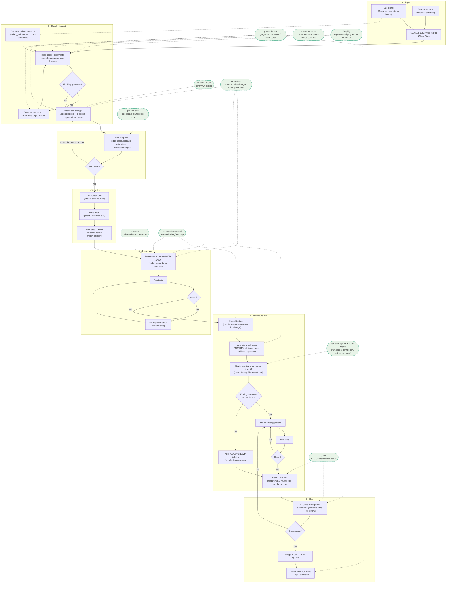

# Team workflow: from signal to merged PR

End-to-end flow (feature or bug) with every tool's plug-in point.
Solid arrows = the flow; dotted arrows = a tool plugging into a phase.
Cross-cutting tools (active in every phase) are listed after the diagram.

## Cross-cutting tools (active in every phase)

| Tool | Where it lives | What it does |
|---|---|---|
| **rtk** | global hook | compresses shell output in every Bash call |
| **ponytail** | plugin, always on | minimal working solutions; less code, fewer tokens |
| **Headroom** | MCP | context compression on long sessions (append-only — prompt cache survives) |
| **serena** | MCP | symbol-level code navigation instead of whole-file reads |
| **spec-guard + pre-commit hooks** | `.claude/hooks/`, `.git/hooks/` | block code edits without an active OpenSpec change; ruff, hygiene, `make sdd-check` on commit |

**caveman** is not installed — it exists only as a benchmark arm inside the
ponytail repo; ponytail covers it.
