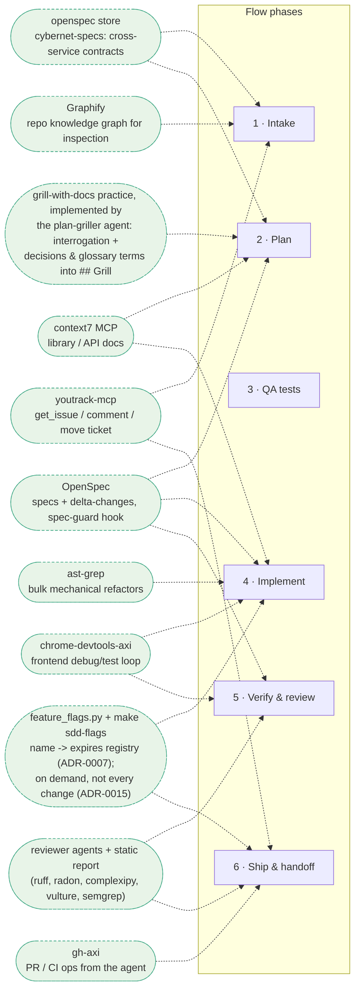

# Team workflow: from signal to merged PR

End-to-end flow (feature or bug) with every tool's plug-in point.
The first diagram is the flow itself; the second maps tools to phases.
Cross-cutting tools (active in every phase) are listed after the diagrams.

This document describes the TARGET process. What is already running vs
still planned is tracked in the **Status** section at the end; planned
pieces are marked *(planned)* in the text.

This is an OVERVIEW, not the procedure. The executable canon of the per-task
process lives in the `feature-flow` skill (features) and the `incident-flow`
skill (bugs/incidents) - the diagram below is those skills drawn as one
picture, and testing detail lives in `QA-SDD-PROCESS.md`. Which ADR stands
behind which rule: the **Grounding** table at the end.

```mermaid
flowchart TD
    %% ============ RAISE INTAKE (above the dev process, ADR-0009) ============
    subgraph RAISE["0 · RAISE intake (company process)"]
        FEAT["Feature request<br/>(business / Rashid)"]
        FORM["Request form + RICE score<br/>(requester, validated by process owner)"]
        BOARD["Voicebot + LLM board:<br/>monthly review / urgent ad-hoc path"]
        BUG["Bug signal<br/>(Telegram: 'something broke')"]
        BUGREP["Bug report ticket (immediately,<br/>no RICE): env, Dialogue ID, steps,<br/>actual/expected, priority"]
        YT["YouTrack ticket WEB-XXXX<br/>accepted into a sprint"]
        FEAT --> FORM --> BOARD --> YT
        BUG --> BUGREP --> YT
    end

    %% ============ INTAKE + TIER ============
    subgraph INTAKE["1 · Check / inspect + tier (feature-flow 1, 1b · incident-flow 1, 2)"]
        READ["Interrogate the ticket:<br/>cross-check claims against code & specs;<br/>missing RICE form = warn, not block"]
        INC["Bug only: collect evidence<br/>(CybernetKZ/incident_collect,<br/>needs its .env configured) -> root-cause doc"]
        CLASS{"Root cause?"}
        STOPDOC(["Client misuse / infra: the root-cause<br/>doc IS the deliverable. Ticket comment +<br/>status via youtrack-mcp; the ticket author /<br/>process owner closes it, not the dev<br/>(interim decision, ADR-0012)"])
        Q{"Serious business fork?"}
        ASK["Ask author (ticket comment);<br/>meanwhile build a PROTOTYPE on the<br/>recommended answer - marked as such,<br/>with a request to verify it"]
        NOTE["Non-blocking gaps: note assumptions,<br/>ask + proceed on recommended answers"]
        TIER["Pick tier: light / standard / deep<br/>(heuristic table below; dev may override;<br/>tier + why -> into the change)"]
        READ --> Q
        Q -- "yes" --> ASK --> READ
        Q -- "no" --> NOTE --> TIER
    end
    YT --> READ
    BUGREP -.-> INC --> CLASS
    CLASS -- "misuse / infra" --> STOPDOC
    CLASS -- "code bug" --> READ

    %% ============ PLAN ============
    subgraph PLANNING["2 · Plan (OpenSpec change) (feature-flow 2 · incident-flow 3)"]
        RESEARCH["deep tier only: research architecture<br/>options, compare, write the change's design.md<br/>(ADRs stay in sdd-kit)"]
        PLAN["planner agent (opus): openspec-propose -<br/>proposal + spec deltas + tasks<br/>(ticket id, tier + why inside)"]
        GRILL["standard/deep: plan-griller agent (opus)<br/>grills the plan, the dev answers (ADR-0012) -<br/>edge cases, rollback, migrations, cross-service;<br/>unanswered -> question to the ticket author.<br/>Q&A recorded as '## Grill' section in proposal.md"]
        POK{"Plan holds?"}
        RESEARCH --> PLAN
        PLAN -- "standard/deep" --> GRILL --> POK
        POK -- "no: fix plan, not code later" --> PLAN
    end
    TIER -- "deep" --> RESEARCH
    TIER -- "standard" --> PLAN
    TIER -- "light: minimal change<br/>(why + what + regression test)" --> PLAN

    %% ============ QA: TESTS BEFORE CODE ============
    subgraph QAF["3 · Tests from the spec delta, BEFORE code (QA-SDD-PROCESS.md, ADR-0016)"]
        QAVAL["Validate the spec delta:<br/>every Requirement has a measurable<br/>Scenario (WHEN/THEN), edge cases covered,<br/>no conflict with existing contracts"]
        QOK{"Spec delta<br/>testable?"}
        QATESTS["test-author agent writes tests from<br/>Scenarios - one test (or explicit skip)<br/>per Scenario, tracer '# spec: requirement /<br/>scenario'. The implementer never writes them;<br/>human QA ownership = target (ADR-0016)"]
        ADV["Adversarial check: independent agent<br/>tries to refute each test<br/>(green-stub detection)"]
        RED["Tests RED before implementation"]
        QAVAL --> QOK
        QOK -- "yes" --> QATESTS --> ADV --> RED
    end
    POK -- "yes" --> QAVAL
    QOK -- "no: spec delta back<br/>to its author" --> PLAN
    PLAN -- "light: minimal spec delta,<br/>same QA validation" --> QAVAL

    %% ============ IMPLEMENT ============
    subgraph IMPL["4 · Implement (feature-flow 4, 4b · incident-flow 4)"]
        CODE["Branch feature/WEB-XXXX off dev.<br/>executor agent (sonnet) walks tasks.md;<br/>code + spec deltas move together.<br/>The tests already exist - it runs them<br/>while implementing, and stops-and-reports<br/>on any deviation from the plan.<br/>Epic: several small PRs; a feature flag only<br/>if it must ship dark (optional, ADR-0015)"]
        RUN1["Run the tests"]
        T1{"Green?"}
        FIX["Fix implementation<br/>(never the tests - not the implementer's)"]
        CODE --> RUN1 --> T1
        T1 -- "no: code wrong" --> FIX --> RUN1
        T1 -- "no: test contradicts its Scenario -<br/>dispute it: back to the test step with the<br/>argument, dev never edits it (ADR-0012)" --> QATESTS
    end
    RED --> CODE

    %% ============ VERIFY ============
    subgraph VERIFY["5 · Verify & review (feature-flow 5, 6 · incident-flow 5)"]
        MANUAL["Manual testing: walk the QA Scenarios<br/>on local/stage; incident: re-run the<br/>incident scenario, record before/after"]
        SDDCHECK["make sdd-check green<br/>(AGENTS.md + openspec validate + spec-lint)"]
        REVIEW["Review: reviewer agents on the diff<br/>(backend-reviewer + database-reviewer,<br/>ECC-derived, ours now)"]
        SCOPE{"Findings in scope<br/>of the ticket?"}
        APPLY["Implement suggestions"]
        TODO["Add TODO/NOTE with ticket id<br/>(no silent scope creep)"]
        RUN2["Run tests"]
        T2{"Green?"}
        MANUAL --> SDDCHECK --> REVIEW --> SCOPE
        SCOPE -- "yes" --> APPLY --> RUN2 --> T2
        SCOPE -- "no" --> TODO --> PR
        T2 -- "no" --> APPLY
    end
    T1 -- "yes" --> MANUAL

    %% ============ SHIP ============
    subgraph SHIP["6 · Ship & handoff (feature-flow 7, 8 · incident-flow 5, 6)"]
        PR["Open PR to dev<br/>[feature/WEB-XXXX] title, test plan in body.<br/>Signals: branch age (2d warn / 5d red),<br/>PR size (xl-ok label needs 'Why XL')"]
        CI["All CI checks are ADVISORY today (ADR-0015):<br/>no branch protection, no required check.<br/>sdd-gate, tests (make sdd-test), tbd-gates,<br/>autoreview; traceability + QA quality gates (planned)"]
        CIOK{"Gates green?"}
        MERGE["Merge to dev"]
        HANDOFF["Ticket -> status: ready_to_test<br/>+ comment for QA ≤ 1 paragraph:<br/>what & how to check, flag name + FLAG_NAME=1 if any"]
        QA["QA verifies on stage; if there IS a flag,<br/>it is enabled with FLAG_NAME=1 per the handoff<br/>comment, then the flag owner enables it in prod<br/>(same owner deletes it at expires, ADR-0013);<br/>change archived"]
        PR --> CI --> CIOK
        CIOK -- "no" --> APPLY
        CIOK -- "yes" --> MERGE --> HANDOFF --> QA
    end
    T2 -- "yes" --> PR

    classDef terminal fill:#fdf2e0,stroke:#c93
    class STOPDOC terminal
```

## Tool plug-ins (which tool serves which phase)

## Procedure lives in the skills, not here

Four rule sets used to be duplicated in this document. Their canon is now
single-sourced; this is the one-line summary plus where to read them:

- **Task tiers** (light / standard / deep) scale preparation depth only -
  gates never change and no tier bypasses spec-guard. Table, pipelines,
  model binding and the picking heuristic: `feature-flow` §1b.
- **Epics**: 1 YouTrack task = 1 PR, split declared in the tracker at intake,
  one OpenSpec change spanning the epic, tests written once for the whole
  change. Details: `feature-flow` §2 (an undeclared epic is suspected whenever
  a single PR would cross the >1500-lines / >2-days signals; follow-up fix PRs
  for an already-accepted feature may ride the original task).
- **Who writes the tests**: the `test-author` agent today, in its own context,
  from the spec delta - never the implementer; human QA owning the step is the
  target, and `ready_to_test` holds the release until a human verdict exists.
  Details: `QA-SDD-PROCESS.md` + `feature-flow` §3.
- **Disputed tests**: a red test is either wrong implementation, a test
  contradicting its Scenario (dispute it - the dev never edits it), or an
  ambiguous Scenario (back to the spec delta's author). Details:
  `feature-flow` §4.

## Where the named pieces live

| Piece | Place in the flow |
|---|---|
| `feature-flow` skill | IS phases 1-6 for features (its steps 1->8 are marked on the phase titles) - the orchestrator the agent follows |
| `incident-flow` skill | IS phases 1-6 for bugs (steps 1->6 marked on the phase titles); owns the misuse/infra terminal exit; defaults to light tier |
| `QA-SDD-PROCESS.md` | IS phase 3 and the test-related CI gates (planned): validate the spec delta, write tests before implementation, traceability, adversarial check. Who executes the writing step: the `test-author` agent today, human QA as the target (ADR-0016) |
| `AGENTS.md` (+`CLAUDE.md` symlink) | ambient context read by the agent in every phase; existence/size gated by sdd-check |
| `planner` / `plan-griller` agents | phase 2 on opus (`model` frontmatter, ADR-0013): planner writes the change, plan-griller interrogates it |
| `test-author` agent | phase 3 on sonnet (ADR-0016): one failing test per Scenario from the spec delta, tracer `# spec: ...`, RED confirmed; writes test files only, never implementation |
| `executor` agent | phase 4 on sonnet (ADR-0021): walks `tasks.md` of a grilled change with RED tests, ticking tasks as it goes; never edits tests, never commits, stops-and-reports on any deviation from the plan instead of improvising - disputes and "change the plan?" calls go back to the orchestrator |
| `spec-miner` agent | repo onboarding only (seed specs one capability at a time), NOT in the per-task loop; OpenSpec has no built-in equivalent |
| reviewer agents | `backend-reviewer` + `database-reviewer` - ECC-derived (commit ec92b528), consolidated from four agents into two; they replace the old `review-pr.md` prompt, locally (`make sdd-review`) and in CI autoreview |

## No magic: prompts vs hooks (what actually enforces)

"Skills", "rules" and "plugins" are marketing names for prompts - instruction
texts injected into the model's context, on every request or at key points.
The model can ignore them: a prompt is advice, never a guarantee. Hooks
(pre-commit, PreToolUse/PreCompact) are ordinary deterministic code bound to
events - e.g. blocking a code edit that has no active openspec change, or
ruff autofix on staged Python before every commit - and cannot be ignored.

Consequences:

- **Enforcement lives only in deterministic code** (hooks + CI gates).
  Prompt-layer pieces (feature-flow, reviewer agents) are advisory - useful,
  but a standard cannot rest on them.
- **And today even the CI half is advisory by choice** (ADR-0015): branch
  protection is off and no check is required, so the only thing that actually
  blocks anyone is local - spec-guard, the `--no-verify` blocker and the
  pre-commit hook. Server-side gates are signals in a log. Turning them into
  real gates is one deliberate decision (required check + branch protection),
  deferred on purpose.
- **Verifiability is mandatory.** Every skill/tool must have a way to confirm
  it actually ran: a measured artifact, a log line, a gate that fails without
  it. Unverifiable pieces get removed - 95% of ~285 installed skills were
  never used once (`docs/archive/OUR_PATTERNS.md`), and `repo-audit` exists to keep it
  that way.

## Prototype instead of waiting

A serious business fork blocks the decision, not the hands: while the ticket
author answers, build a prototype on the recommended answer - explicitly marked
as such, with a request to verify it. Either the answer confirms the direction
or the prototype is cheaply discarded; both beat idling. Gates are unchanged:
the prototype lives under the same OpenSpec change, and nothing merges while a
blocking question is open.

## Cross-cutting tools (active in every phase)

Installed per developer machine by `install.sh --machine-only` (core stack, default-yes):

| Tool | What it does |
|---|---|
| **rtk** | compresses shell output in every Bash call (global hook) |
| **ponytail** | minimal working solutions; less code, fewer tokens (plugin) |
| **ast-grep** | structural codemods for bulk mechanical refactors |
| **spec-guard + pre-commit hooks** | block code edits without an active OpenSpec change (not in conversation_flow - LIVING SPEC exception); ruff, hygiene, `make sdd-check` on commit |

Opt-in (y/N): **gh-axi**, **chrome-devtools-axi**, **serena** (earlier trial
left `.serena/` litter; the sdd-doctor audit section flags it). **caveman** is not installed -
it exists only as a benchmark arm inside the ponytail repo; ponytail covers it.

## Grounding: правило -> ADR

Промпты (`templates/skills/*`, `templates/agents/*`) несут само правило фразой,
без `ADR-XXXX` - целевой репозиторий не имеет `docs/ADR/` (ADR-0022 п.2). Связь
"правило -> решение" живёт здесь. Меняешь правило - проверь эту таблицу.

| Правило (одной фразой) | ADR |
|---|---|
| Enforcement живёт только в детерминированном коде (хуки + CI-гейты); промпты - совет | ADR-0003 |
| `make sdd-test` - единая точка входа тестов для CI | ADR-0003 |
| Граф repo - только навигация/контекст, никогда гейт; `[INFERRED]` рёбра проверять в коде | ADR-0004 |
| Ветка ≤2 дней, размер PR ограничен; сигналы >1500 строк / >2 дней; CI предупреждает, не блокирует | ADR-0006 |
| Реестр фича-флагов: имя -> `expires`, доступ через `is_enabled()`, OFF по умолчанию, `make sdd-flags` красит CI через 7 дней после `expires` | ADR-0007 |
| Крупная замена - branch by abstraction, абстракция удаляется после cutover | ADR-0007 §5 |
| Задачи приходят через RAISE: форма запроса + RICE; баг-репорт сразу, без RICE; urgent ускоряет ПРИОРИТИЗАЦИЮ, не разработку | ADR-0009 |
| Тиры (light/standard/deep) масштабируют глубину подготовки, гейты не меняют; тир + обоснование пишутся в change | ADR-0010 |
| Один OpenSpec change на весь эпик; архивирование - когда флаг включён в prod (или, без флага, после мержа последней задачи); handoff-шов SDD↔TBD | ADR-0011 |
| Имя флага + `FLAG_<NAME>=1` в handoff-комментарии для QA | ADR-0011 §2 |
| Grill плана: разработчик отвечает, неотвеченное уходит автору тикета; правим план, не код потом | ADR-0012 |
| Спорный тест: три выхода (код неверен / тест противоречит Scenario / Scenario неоднозначен); реализующий тест не правит | ADR-0012 |
| Traceability-гейт (Scenario ⇄ тест) и QA-гейт - дисциплина ревью, пока их нет в CI | ADR-0012 п.8 |
| 1 задача YouTrack = 1 PR; эпик разбивается в трекере; тесты эпика пишутся один раз на весь change | ADR-0013 |
| `ready_to_test` держит релиз до человеческого QA-вердикта; владелец флага удаляет его по `expires` | ADR-0013 |
| Модели зафиксированы во frontmatter агентов (planner/plan-griller opus) - не выбираются на бегу | ADR-0013 |
| Все CI-проверки advisory: нет branch protection, нет required check; блокирует только локальное (spec-guard, pre-commit) | ADR-0015 |
| Флаги - по требованию, не шаг процесса; открытый вопрос: кто и где ставит `FLAG_<NAME>=1` на stage/prod | ADR-0015 |
| Store - потребитель агент, читающий кросс-сервисные спеки, не машинный гейт | ADR-0015 |
| Тесты пишутся из spec delta ДО реализации, агентом `test-author` (один тест или явный skip на Scenario, tracer `# spec:`), RED до кода; adversarial-проверка отдельным агентом; человеческий QA - целевое состояние, в PR это указывается | ADR-0016 |
| Spec-метаданные: в дельте для repo-спек каждый Requirement несёт `<!-- id: ... -->` и `<!-- enforced: <file>:<symbol> -->` (проверяет spec-lint); дельта против store-спеки - без них, store - прозой с `file.py:line`-якорями | ADR-0017 |
| Правка кросс-repo контракта - отдельный change + PR в `cybernet-specs`; в своём change остаётся обоснование и задача с id того change; не архивируется, пока store-PR открыт | ADR-0018 |
| Реализация - субагент `executor` на sonnet: строго по tasks.md, не правит тесты, не коммитит, стоп-и-отчёт при отклонении; секции tasks.md пока последовательны | ADR-0021 |
| Тир фиксирует пайплайн (light без planner/griller; deep - grill только агентом) | ADR-0021 |
| `## Grill` открывается provenance-заголовком: кто грилил, сколько вопросов, что изменилось | ADR-0021 |
| В промптах нет `ADR-XXXX`; вывод человеку - по-русски, машинные форматы/теги - английские | ADR-0022 |

Без ADR (правило живёт только в текстах - кандидат на фиксацию отдельным
решением): deep-тир пишет сравнение архитектурных опций в `design.md` самого
change'а, а не в ADR, потому что в целевых репозиториях нет `docs/ADR/`
(сформулировано в `feature-flow` §1b/§2 и `planner.md` п.7, ни одним ADR не
покрыто).

## Status: what runs today vs what is planned

Last verified: 2026-08-04 (text revision, ADR-0022: install --repo-only + sdd-check green on a scratch repo). Update this table when a planned piece goes live.

| Component | Status |
|---|---|
| bootstrap assets: `make sdd-check`, spec-guard, pre-commit hooks, `sdd-ci.yml` (incl. tbd-gates), autoreview, spec-lint, sdd-doctor (incl. audit section) | shipped by sdd-kit - live in a repo once bootstrapped |
| **enforcement model** | **advisory by design** (ADR-0015): branch protection OFF, no required check - sdd-gate / tbd-gates / autoreview are signals, not blocks. Only the local hooks (spec-guard, `--no-verify` blocker, pre-commit) block anything today. Activation of the ADR-0003 model is deferred, not cancelled |
| `feature-flow` / `incident-flow` skills | shipped (`templates/skills/`) |
| `planner` / `plan-griller` agents (model binding for plan/grill) | shipped (`templates/agents/`, ADR-0013) |
| `test-author` agent (tests before code) | shipped (`templates/agents/`, ADR-0016) |
| **feature flags** | **dormant / on demand** (ADR-0015): the registry + `make sdd-flags` ship and work, but no process step requires a flag. Open question: who sets `FLAG_X=1` on stage/prod and where |
| central store (cybernet-specs) | live - consumer is the **agent** reading cross-service specs at intake/planning, not a machine gate (ADR-0015) |
| RAISE intake (form, RICE, board) | company process being introduced (ADR-0009) |
| `make sdd-test` single CI entry point (ADR-0003) | **есть, advisory** (ADR-0015): `make sdd-test` (ruff + pytest, graceful skip) runs locally and as the `tests` CI job - green/red, not required |
| human QA owning phase 3 (writes tests before code) | **target state** (ADR-0016) - today `test-author` writes, human QA validates |
| traceability gate (Scenario ⇄ test) in CI | **planned** - no implementation yet |
| QA quality gate in CI | **planned** |
| frontend profile (frontend-reviewer, TS flags variant) | **backlog, low priority** (ADR-0015 p.5) - web-frontend-new gets the standard backend-oriented install |
